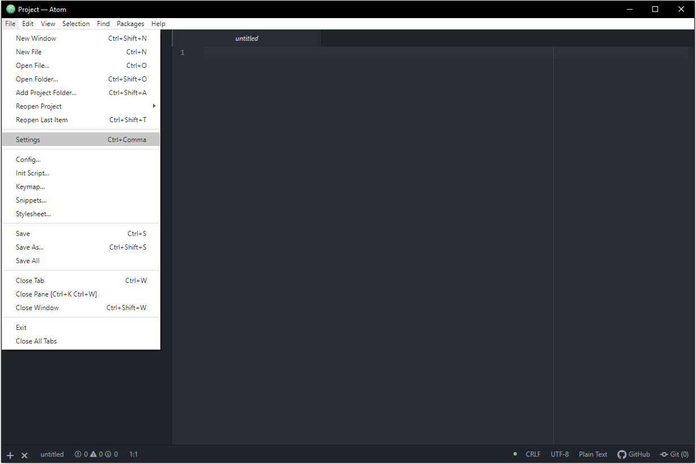
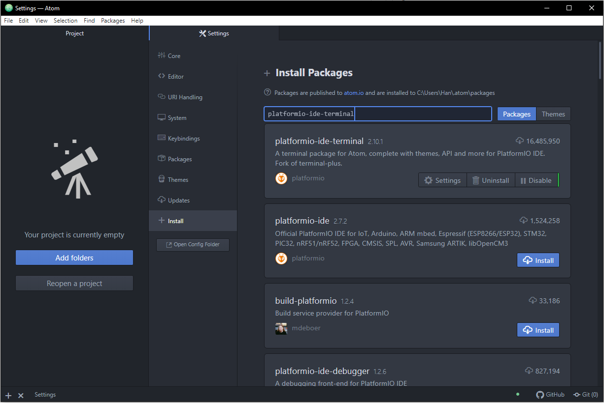
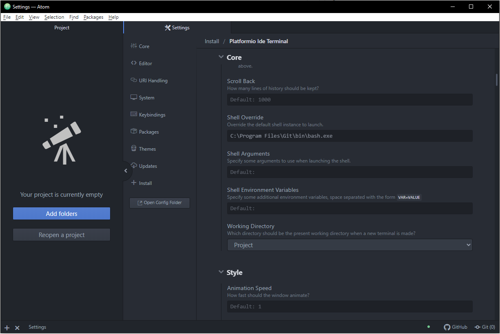
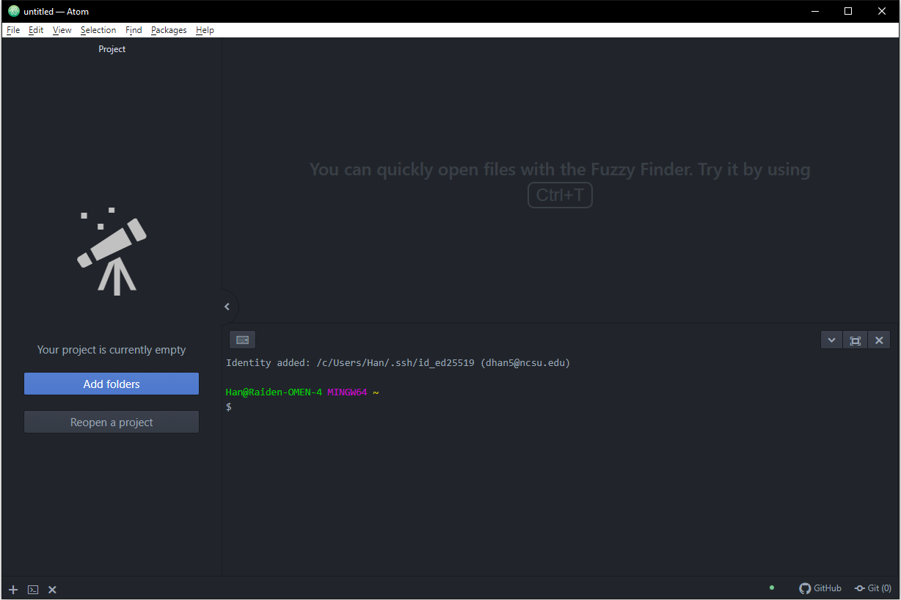
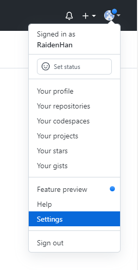
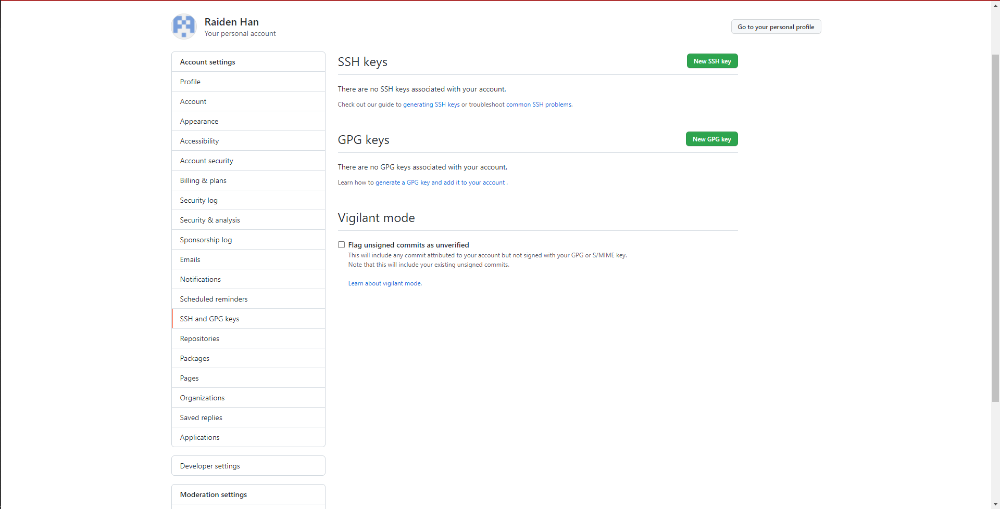

# Week 1 - Introduction to Git, Github, and Functional Programming


## Configure Your Atom (Optional)

1. Install a terminal/command line we can use directly in Atom. Inside of Atom, open up the `Settings`

2. In the settings, click on the install tab, search for “platformio-ide-terminal” in the search bar, and hit `Install`

3. Open up the platformio-ide-terminal package `Settings`, scroll down to `Shell Override`, and enter: `C:\Program Files\Git\bin\bash.exe`

4. Open up the terminal by pressing `` CTRL + ` ``



## Configure Your Git Information

Inside of the `Atom Git Bash terminal` or the default `Windows Command Prompt`, run the following code to configure your Git information.
```Shell
git config --global user.name "your_username"
git config --global user.email "your_email@example.com"
```

The following command will help you check it.
```Shell
git config --global -l
```


## Set up Your GitHub SSH Key (Optional, but Highly Recommended)

Reference: [Connecting to GitHub with SSH](https://docs.github.com/en/authentication/connecting-to-github-with-ssh)

1. Use the following command to generate a new SSH key
```Shell
ssh-keygen -t ed25519 -C "your_email@example.com"
```
2. To connect to GitHub without verifying your SSH each time, we set up anto-launching `ssh-agent` by creating a file under your global environment. Run
```Shell
atom ~/.profile
```
inside of the `Atom Git Bash terminal`, or
```Shell
notepad ~/.profile
```
inside of the `Command Prompt`. Copy and paste the following code. Make sure to save the file
```Shell
env=~/.ssh/agent.env

agent_load_env () { test -f "$env" && . "$env" >| /dev/null ; }

agent_start () {
    (umask 077; ssh-agent >| "$env")
    . "$env" >| /dev/null ; }

agent_load_env

# agent_run_state: 0=agent running w/ key; 1=agent w/o key; 2=agent not running
agent_run_state=$(ssh-add -l >| /dev/null 2>&1; echo $?)

if [ ! "$SSH_AUTH_SOCK" ] || [ $agent_run_state = 2 ]; then
    agent_start
    ssh-add
elif [ "$SSH_AUTH_SOCK" ] && [ $agent_run_state = 1 ]; then
    ssh-add
fi

unset env
```
3. Restart your `Atom Git Bash terminal` or `Command Prompt` to launch `ssh-agent`, or run the following code to start it manually
```Shell
eval "$(ssh-agent -s)"
```
4. Add your SSH private key to the ssh-agent
```Shell
ssh-add ~/.ssh/id_ed25519
```
5. Add the SSH key to your account on GitHub. Login into your personal page and find the `Settings`

6. Switch to `SSH and GPG keys` tab, and click `New SSH Key`

7. Run the code or manually copy your key and paste it into the `Key` field
```Shell
clip < ~/.ssh/id_ed25519.pub
```
8. Test your SSH connection and verify the public key with [GitHub's SSH key fingerprints](https://docs.github.com/en/authentication/keeping-your-account-and-data-secure/githubs-ssh-key-fingerprints)
```Shell
ssh -T git@github.com
```


## Git Workflow

### Initialization

1. Change your current path to where you want to store the project locally. The file system command cheat sheet is as follows.

| Command | Explanation                                                       |
|---------|-------------------------------------------------------------------|
| ls      | List all of the files/folders inside of the current directory     |
| cd      | Change directory to the folder you specify (not including the <>) |
| cd ..   | Go up one to the parent of the current directory                  |
| pwd     | Display the full path to the current directory                    |
| mkdir   | Create or make new directories                                    |
2. Run the following command to clone/download a local version of your repository inside of the current directory you are in.
```Shell
git clone <repo_url> <folder_name>
```

### Routine Working with Git

Reference: [Git Documentation](https://git-scm.com/doc)


```Shell
git pull
git add .
git commit -m "<explanation>"
git push
```


## Python Functional Programming

### Example

```Python
def load_stock_benchmark(s_day, e_day):
    """ Load S&P 500 index data from Yahoo! finance

    Parameters
    ----------
    s_day : str
        The start date of data sample
    e_day : str
        The end date of data sample

    Returns
    -------
    stock : DataFrame
        S&P 500 Data from Yahoo! finance
    """

    stock = pdr.get_data_yahoo('SPY', s_day, e_day, interval='m')['Adj Close']
    stock.name = 'SPY'

    return stock
```
