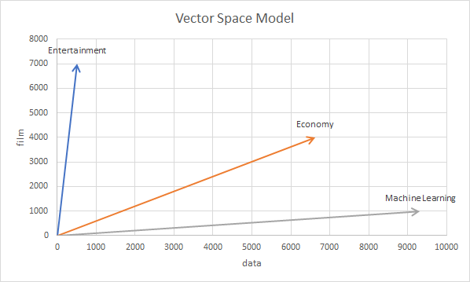
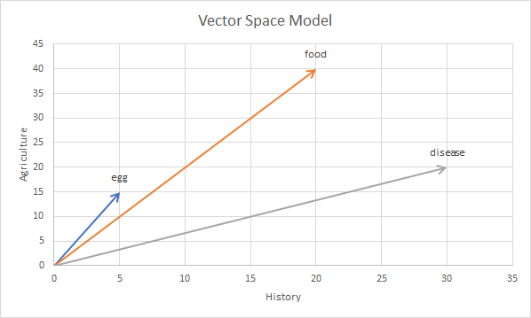
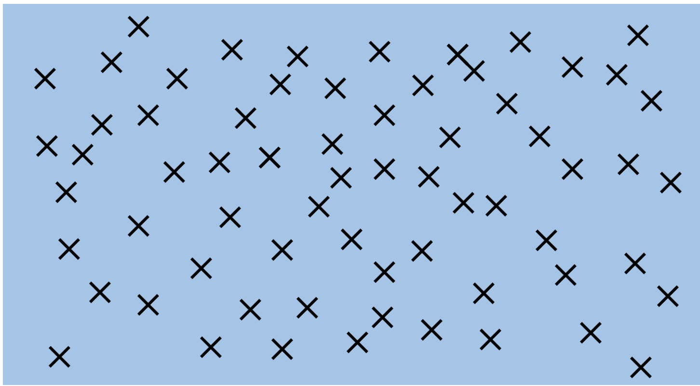

# Week 4 - Vector Space Model, PCA, Approx. KNN and Cosine Similarity

## Reference

- [Google Code Archive - Long-term storage for Google Code Project Hosting](https://code.google.com/archive/p/word2vec/)
- [Euclidean distance - Wikipedia](https://en.wikipedia.org/wiki/Euclidean_distance)
- [Cosine similarity - Wikipedia](https://en.wikipedia.org/wiki/Cosine_similarity)
- [Principal component analysis - Wikipedia](https://en.wikipedia.org/wiki/Principal_component_analysis)
- [sklearn.decomposition.PCA — scikit-learn 1.0.2 documentation](https://scikit-learn.org/stable/modules/generated/sklearn.decomposition.PCA.html)
- [Preprocessing for Machine Learning in Python - DataCamp Learn](https://app.datacamp.com/learn/courses/preprocessing-for-machine-learning-in-python)
- [KNN vs Approximate KNN: What's the difference? | Kaggle](https://www.kaggle.com/pawanbhandarkar/knn-vs-approximate-knn-what-s-the-difference)

## Vector Space Model

> **Vector space model** or **term vector model** is an algebraic model for representing text documents (and any objects, in general) as vectors of identifiers (such as index terms). It is used in information filtering, information retrieval, indexing and relevancy rankings. Its first use was in the SMART Information Retrieval System.

In other words, we can use the sum of word vectors to represent a sentence, and compare the similarity between different vectors. So how could we derive word vectors?

### Examples

#### Example 1.1

Let us assume that we have a massive dataset with detailed categories. And we count the number of each word under a particular category. The following table shows the frequencies of `data` and `film` under three categories.

|      | Entertainment | Economy | Machine Learning |
|------|---------------|---------|------------------|
| data | 500           | 6620    | 9320             |
| film | 7000          | 4000    | 1000             |



#### Example 1.2

```Python
from gensim.models import KeyedVectors

model = KeyedVectors.load_word2vec_format(
    r'data/GoogleNews-vectors-negative300.bin', binary=True)
dog = model['dog']
print(type(dog))
## <class 'numpy.ndarray'>
print(dog.shape)
## (300,)
print(dog[:5])
## [ 0.05126953 -0.02233887 -0.17285156  0.16113281 -0.08447266]
```

## Cosine Similarity

### Definition


### Example

|         | Agriculture | History |
|---------|-------------|---------|
| egg     | 5           | 15      |
| food    | 20          | 40      |
| disease | 30          | 20      |



| Pair           | Euclidean Distance | Cosine Similarity |
|----------------|--------------------|-------------------|
| egg & food     | 29.15              | 0.99              |
| food & disease | 22.36              | 0.87              |

```Python
from sklearn.metrics.pairwise import euclidean_distances, cosine_similarity

egg, food, disease = [5, 15], [20, 40], [30, 20]
print(euclidean_distances([egg], [food]))
## [[29.15475947]]
print(euclidean_distances([food], [disease]))
## [[22.36067977]]
print(cosine_similarity([egg], [food]))
## [[0.98994949]]
print(cosine_similarity([food], [disease]))
## [[0.86824314]]
```

## PCA

### Definition

> **Principal component analysis (PCA)** is the process of computing the principal components and using them to perform a change of basis on the data, sometimes using only the first few principal components and ignoring the rest.

### Application

Dimension Reduction, Data Visualization


## Approx. KNN

### Comparison





### Methodology

- Draw n random hyperplanes and segment the space into several parts
- Identify all points within the same part as the unknown point in
- Apply KNN algorithm among these points
- Repeat


## Integrated Workflow

- Calculate a sentence's embeddings by summing up all the words' embeddings in it
- Using approx. KNN algorithm and cosine similarity to classify the sentence
